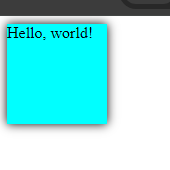
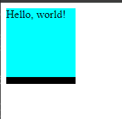
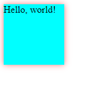
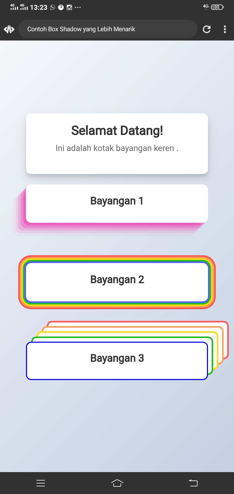
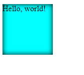

**TUGAS EXPLORASI
ATAS NAMA : HANSAR**
# Apa Itu Box-Shadow

Box shadow adalah salah satu properti CSS yang memungkinkan Anda untuk menambahkan bayangan ke elemen HTML. Dengan menggunakan properti ini, Anda dapat memberikan efek bayangan yang memberi kedalaman dan dimensi pada elemen, sehingga memungkinkan Anda untuk menciptakan tata letak yang lebih menarik dan dinamis. Bayangan yang dihasilkan dapat diberikan warna, ukuran, sudut, dan opasitas tertentu sesuai kebutuhan desain Anda.

# CSS box-shadow Property
## Tentukan Shadow Horizontal
Property `box-shadow` memiliki dua nilai yang mengontrol pergeseran horizontal dan vertikal dari bayangan yang dihasilkan:

**Horizontal Offset**: Ini adalah nilai yang menentukan seberapa jauh bayangan akan dipindahkan secara horizontal dari elemen. Jika Anda ingin bayangan muncul di sebelah kiri elemen, nilai horizontal offset harus bernilai negatif. Jika Anda ingin bayangan muncul di sebelah kanan elemen, nilai horizontal offset harus bernilai positif.

## Contoh Kode Program

```html
<!DOCTYPE html>

<html lang="en">

<head>

    <style>

        .box {

         box-shadow: 10px 0 0 0 black;

         width: 100px;

         height: 100px;

         background-color: cyan;

         }

    </style>

    <title>box-shadow</title>

</head>

<body>

    <div class="box">Hello, world!</div>

</body>

</html>
```

## Hasil



## Penjelasan

1. `<!DOCTYPE html>`: Ini adalah deklarasi DOCTYPE yang menunjukkan bahwa dokumen ini adalah dokumen HTML5.
    
2. `<html lang="en">`: Tag pembuka untuk elemen HTML, dengan atribut `lang` yang menentukan bahasa konten (dalam hal ini, bahasa Inggris).
    
3. `<head>`: Bagian dari dokumen HTML yang berisi informasi tambahan tentang dokumen, seperti meta-data, link ke stylesheet, dan judul halaman.
    
4. `<style>`: Ini adalah tag untuk menuliskan CSS di dalam dokumen HTML. Di dalam tag ini, kita mendefinisikan gaya untuk elemen dengan kelas `.box`.
    
5. `.box`: Ini adalah sebuah kelas CSS yang diterapkan pada elemen div. Dalam hal ini, div akan memiliki efek bayangan menggunakan properti `box-shadow`, lebar dan tinggi 100 piksel, dan latar belakang berwarna cyan.
    
6. `box-shadow: 10px 0 0 0 black;`: Ini adalah properti CSS yang menambahkan bayangan pada elemen. Bayangan akan memiliki pergeseran horizontal sebesar 10 piksel (ke kanan), tanpa pergeseran vertikal (0), tanpa blur (0), tanpa penyebaran (0), dan berwarna hitam.
    
7. `width: 100px;`: Properti CSS yang menetapkan lebar elemen `.box` menjadi 100 piksel.
    
8. `height: 100px;`: Properti CSS yang menetapkan tinggi elemen `.box` menjadi 100 piksel.
    
9. `background-color: cyan;`: Properti CSS yang menetapkan warna latar belakang elemen `.box` menjadi cyan.
    
10. `<title>box-shadow</title>`: Tag untuk menetapkan judul halaman, yang akan ditampilkan di bilah judul browser.
    
11. `<body>`: Tag pembuka untuk elemen body, yang berisi semua konten yang akan ditampilkan di dalam halaman web.
    
12. `<div class="box">Hello, world!</div>`: Ini adalah sebuah div dengan kelas `.box`, yang akan menampilkan teks "Hello, world!" di dalamnya.
    

Secara keseluruhan, program ini akan menampilkan sebuah kotak cyan dengan bayangan hitam yang terletak di sisi kanan.
# Tentukan Shadow Vertikal

**Vertical Offset**: Ini adalah nilai yang menentukan seberapa jauh bayangan akan dipindahkan secara vertikal dari elemen. Jika Anda ingin bayangan muncul di atas elemen, nilai vertical offset harus bernilai negatif. Jika Anda ingin bayangan muncul di bawah elemen, nilai vertical offset harus bernilai positif.


## Contoh Kode Program

```html
<!DOCTYPE html>

<html lang="en">

<head>

    <style>

        .box {

         box-shadow: 0 10px 0 0 black;

         width: 100px;

         height: 100px;

         background-color: cyan;

         }

    </style>

    <title>box-shadow</title>

</head>

<body>

    <div class="box">Hello, world!</div>

</body>

</html>
```

## Hasil



## Penjelasan

1. `.box`: Ini adalah sebuah kelas CSS yang diterapkan pada elemen div.
    
2. `box-shadow: 0 10px 0 0 black;`: Ini adalah properti CSS yang menambahkan bayangan pada elemen. Dalam hal ini, bayangan akan memiliki pergeseran vertikal sebesar 10 piksel (ke bawah), tanpa pergeseran horizontal (0), tanpa blur (0), tanpa penyebaran (0), dan berwarna hitam.
    
3. `width: 100px;`: Properti CSS yang menetapkan lebar elemen `.box` menjadi 100 piksel.
    
4. `height: 100px;`: Properti CSS yang menetapkan tinggi elemen `.box` menjadi 100 piksel.
    
5. `background-color: cyan;`: Properti CSS yang menetapkan warna latar belakang elemen `.box` menjadi cyan.
    
6. `<title>box-shadow</title>`: Tag untuk menetapkan judul halaman.
    
7. `<body>`: Tag pembuka untuk elemen body, yang berisi semua konten yang akan ditampilkan di dalam halaman web.
    
8. `<div class="box">Hello, world!</div>`: Ini adalah sebuah div dengan kelas `.box`, yang akan menampilkan teks "Hello, world!" di dalamnya.

Perbedaan utama antara program ini dan program sebelumnya adalah arah bayangan. Dalam program ini, bayangan akan muncul di bagian bawah kotak, sementara dalam program sebelumnya, bayangan muncul di sebelah kanan kotak.

# Blur Radius

**Blur radius**  adalah salah satu dari empat nilai yang dapat ditentukan dalam properti `box-shadow` dalam CSS. Ini menentukan seberapa banyak bayangan akan di-blur, atau dihaluskan, dari tepi bayangan ke dalam kotak.

## Contoh Kode Program

```html
<!DOCTYPE html>

<html lang="en">

<head>

    <style>

        .box {

        box-shadow: 0 0 10px 0 black;

         width: 100px;

         height: 100px;

         background-color: cyan;

         }

    </style>

    <title>box-shadow</title>

</head>

<body>

    <div class="box">Hello, world!</div>

</body>

</html>
```

## Hasil


## Penjelasan

1. `<!DOCTYPE html>`: Deklarasi DOCTYPE yang menunjukkan bahwa dokumen ini adalah dokumen HTML5.
    
2. `<html lang="en">`: Tag pembuka untuk elemen HTML, dengan atribut `lang` yang menunjukkan bahasa konten (dalam hal ini, bahasa Inggris).
    
3. `<head>`: Bagian dari dokumen HTML yang berisi informasi tambahan tentang dokumen, seperti meta-data, link ke stylesheet, dan judul halaman.
    
4. `<style>`: Ini adalah tag untuk menuliskan CSS di dalam dokumen HTML. Di dalam tag ini, kita mendefinisikan gaya untuk elemen dengan kelas `.box`.
    
5. `.box`: Ini adalah sebuah kelas CSS yang diterapkan pada elemen div.
    
6. `box-shadow: 0 0 10px 0 black;`: Properti CSS yang menambahkan bayangan pada elemen. Bayangan akan memiliki pergeseran vertikal dan horizontal nol, blur radius sebesar 10 piksel, tanpa penyebaran, dan berwarna hitam.
    
7. `width: 100px;`: Properti CSS yang menetapkan lebar elemen `.box` menjadi 100 piksel.
    
8. `height: 100px;`: Properti CSS yang menetapkan tinggi elemen `.box` menjadi 100 piksel.
    
9. `background-color: cyan;`: Properti CSS yang menetapkan warna latar belakang elemen `.box` menjadi cyan.
    
10. `<title>box-shadow</title>`: Tag untuk menetapkan judul halaman.
    
11. `<body>`: Tag pembuka untuk elemen body, yang berisi semua konten yang akan ditampilkan di dalam halaman web.
    
12. `<div class="box">Hello, world!</div>`: Ini adalah sebuah div dengan kelas `.box`, yang akan menampilkan teks "Hello, world!" di dalamnya.
    

Secara keseluruhan, program ini akan menampilkan sebuah kotak dengan lebar dan tinggi 100 piksel, latar belakang berwarna cyan, dan bayangan hitam yang memiliki efek blur dengan radius 10 piksel.

# Spread Radius

Spread radius adalah salah satu parameter yang dapat ditentukan dalam properti `box-shadow` dalam CSS. Ini menentukan seberapa jauh bayangan akan tersebar dari batas elemen yang menghasilkannya.

## Contoh Kode Program

```html
<!DOCTYPE html>

<html lang="en">

<head>

    <style>

        .box {

         box-shadow: 0 0 0 10px black;

         width: 100px;

         height: 100px;

         background-color: cyan;

         }

    </style>

    <title>box-shadow</title>

</head>

<body>

    <div class="box">Hello, world!</div>

</body>

</html>
```

## Hasil



## Penjelasan

1. `<!DOCTYPE html>`: Ini adalah deklarasi DOCTYPE yang menunjukkan bahwa dokumen ini adalah dokumen HTML5.
    
2. `<html lang="en">`: Tag pembuka untuk elemen HTML, dengan atribut `lang` yang menunjukkan bahasa konten (dalam hal ini, bahasa Inggris).
    
3. `<head>`: Bagian dari dokumen HTML yang berisi informasi tambahan tentang dokumen, seperti meta-data, link ke stylesheet, dan judul halaman.
    
4. `<style>`: Ini adalah tag untuk menuliskan CSS di dalam dokumen HTML. Di dalam tag ini, kita mendefinisikan gaya untuk elemen dengan kelas `.box`.
    
5. `.box`: Ini adalah sebuah kelas CSS yang diterapkan pada elemen div.
    
6. `box-shadow: 0 0 0 10px black;`: Properti CSS yang menambahkan bayangan pada elemen. Bayangan akan memiliki pergeseran vertikal dan horizontal nol, blur radius nol, spread radius sebesar 10 piksel, dan berwarna hitam.
    
7. `width: 100px;`: Properti CSS yang menetapkan lebar elemen `.box` menjadi 100 piksel.
    
8. `height: 100px;`: Properti CSS yang menetapkan tinggi elemen `.box` menjadi 100 piksel.
    
9. `background-color: cyan;`: Properti CSS yang menetapkan warna latar belakang elemen `.box` menjadi cyan.
    
10. `<title>box-shadow</title>`: Tag untuk menetapkan judul halaman.
    
11. `<body>`: Tag pembuka untuk elemen body, yang berisi semua konten yang akan ditampilkan di dalam halaman web.
    
12. `<div class="box">Hello, world!</div>`: Ini adalah sebuah div dengan kelas `.box`, yang akan menampilkan teks "Hello, world!" di dalamnya.
    

Secara keseluruhan, program ini akan menampilkan sebuah kotak dengan lebar dan tinggi 100 piksel, latar belakang berwarna cyan, dan bayangan hitam dengan spread radius 10 piksel yang memberi kesan penyebaran bayangan ke luar dari batas kotak.
# Color for the Shadow

## Kode program

```html

<!DOCTYPE html>

<html lang="en">

<head>

    <style>

        .box {

         box-shadow: 0 0 10px 0 rgba(255, 0, 0, 0.5);

         width: 100px;

         height: 100px;

         background-color: cyan;

         }

    </style>

    <title>box-shadow</title>

</head>

<body>

    <div class="box">Hello, world!</div>

</body>

</html>
```

## Hasil



## Penjelasan

1. `<!DOCTYPE html>`: Ini adalah deklarasi DOCTYPE yang menunjukkan bahwa dokumen ini adalah dokumen HTML5.
    
2. `<html lang="en">`: Ini adalah tag pembuka untuk elemen HTML, dengan atribut `lang` yang menunjukkan bahasa konten (dalam hal ini, bahasa Inggris).
    
3. `<head>`: Ini adalah bagian dari dokumen HTML yang berisi informasi tambahan tentang dokumen, seperti meta-data, link ke stylesheet, dan judul halaman.
    
4. `<style>`: Ini adalah tag untuk menuliskan CSS di dalam dokumen HTML. Di dalam tag ini, kita mendefinisikan gaya untuk elemen dengan kelas `.box`.
    
5. `.box`: Ini adalah sebuah kelas CSS yang diterapkan pada elemen div.
    
6. `box-shadow: 0 0 10px 0 rgba(255, 0, 0, 0.5);`: Properti CSS yang menambahkan bayangan pada elemen. Bayangan memiliki pergeseran vertikal dan horizontal nol (0 0), blur radius sebesar 10 piksel, tanpa penyebaran (spread radius), dan berwarna merah dengan tingkat kebutubahan sebesar 50%.
    
7. `width: 100px;`: Properti CSS yang menetapkan lebar elemen `.box` menjadi 100 piksel.
    
8. `height: 100px;`: Properti CSS yang menetapkan tinggi elemen `.box` menjadi 100 piksel.
    
9. `background-color: cyan;`: Properti CSS yang menetapkan warna latar belakang elemen `.box` menjadi cyan.
    
10. `<title>box-shadow</title>`: Tag untuk menetapkan judul halaman.
    
11. `<body>`: Ini adalah tag pembuka untuk elemen body, yang berisi semua konten yang akan ditampilkan di dalam halaman web.
    
12. `<div class="box">Hello, world!</div>`: Ini adalah sebuah div dengan kelas `.box`, yang akan menampilkan teks "Hello, world!" di dalamnya.
    

Secara keseluruhan, program ini akan menampilkan sebuah kotak dengan lebar dan tinggi 100 piksel, latar belakang berwarna cyan, dan bayangan merah dengan efek blur sebesar 10 piksel dan tingkat kebutubahan 50%.


# Inset

Inset adalah sebuah nilai yang dapat diberikan dalam properti `box-shadow` dalam CSS. Ketika nilai inset ditetapkan, bayangan akan muncul di dalam elemen daripada di luar. Ini memberikan efek seperti emboss atau inset shadow pada elemen.
## Kode program
```html
<!DOCTYPE html>

<html lang="en">

<head>

    <style>

        .box {

         box-shadow: inset 0 0 10px 0 black;

         width: 100px;

         height: 100px;

         background-color: cyan;

         }

  

    </style>

    <title>box-shadow</title>

</head>

<body>

    <div class="box">Hello, world!</div>

</body>

</html>
```

## Hasil 



## Penjelasan

1. `<!DOCTYPE html>`: Ini adalah deklarasi DOCTYPE yang menunjukkan bahwa dokumen ini adalah dokumen HTML5.
    
2. `<html lang="en">`: Ini adalah tag pembuka untuk elemen HTML, dengan atribut `lang` yang menunjukkan bahasa konten (dalam hal ini, bahasa Inggris).
    
3. `<head>`: Ini adalah bagian dari dokumen HTML yang berisi informasi tambahan tentang dokumen, seperti meta-data, link ke stylesheet, dan judul halaman.
    
4. `<style>`: Ini adalah tag untuk menuliskan CSS di dalam dokumen HTML. Di dalam tag ini, kita mendefinisikan gaya untuk elemen dengan kelas `.box`.
    
5. `.box`: Ini adalah sebuah kelas CSS yang diterapkan pada elemen div.
    
6. `box-shadow: inset 0 0 10px 0 black;`: Properti CSS yang menambahkan bayangan pada elemen. Bayangan memiliki nilai inset, yang berarti bayangan akan muncul di dalam elemen. Bayangan tersebut memiliki pergeseran vertikal dan horizontal nol (0 0), blur radius sebesar 10 piksel, tanpa penyebaran (spread radius), dan berwarna hitam.
    
7. `width: 100px;`: Properti CSS yang menetapkan lebar elemen `.box` menjadi 100 piksel.
    
8. `height: 100px;`: Properti CSS yang menetapkan tinggi elemen `.box` menjadi 100 piksel.
    
9. `background-color: cyan;`: Properti CSS yang menetapkan warna latar belakang elemen `.box` menjadi cyan.
    
10. `<title>box-shadow</title>`: Tag untuk menetapkan judul halaman.
    
11. `<body>`: Ini adalah tag pembuka untuk elemen body, yang berisi semua konten yang akan ditampilkan di dalam halaman web.
    
12. `<div class="box">Hello, world!</div>`: Ini adalah sebuah div dengan kelas `.box`, yang akan menampilkan teks "Hello, world!" di dalamnya.
    

Program ini akan menampilkan sebuah kotak dengan lebar dan tinggi 100 piksel, latar belakang berwarna cyan, dan bayangan hitam yang muncul di dalam kotak dengan efek blur sebesar 10 piksel.


# Implementasi
Implementasi adalah proses pelaksanaan atau penerapan suatu rencana, kebijakan, program, atau sistem ke dalam praktik nyata. Tujuan implementasi adalah untuk mengubah konsep atau ide yang telah dirancang menjadi aksi nyata yang menghasilkan output yang diinginkan. Dalam konteks yang berbeda, implementasi bisa memiliki fokus yang beragam, misalnya.

## KODE PROGRAM
```html
<!DOCTYPE html>
<html lang="en">
<head>
    <meta charset="UTF-8">
    <meta name="viewport" content="width=device-width, initial-scale=1.0">
    <title>Contoh Box Shadow yang Lebih Menarik</title>
    <link rel="stylesheet" href="stylees.css">
</head>
<body>
    <div class="container">
        <div class="box">
            <h1>Selamat Datang!</h1>
            <p>Ini adalah kotak bayangan keren .</p>
            
        </div>
        <div class="box-shadow-1">
            <h2>Bayangan 1</h2>
          
        </div><br><br>
        <div class="box-shadow-2">
            <h2>Bayangan 2</h2>
           
        </div><br><br>
        <div class="box-shadow-3">
            <h2>Bayangan 3</h2>
           
        </div><br><br>
    </div>
</body>
</html>
```

## Hasil


## Penjelasan

1. **<!DOCTYPE html>**: Mendefinisikan tipe dokumen dan versi HTML yang digunakan, yaitu HTML5.

2. **<html lang="en">: Elemen root dari dokumen HTML, dengan atribut lang yang menunjukkan bahasa dokumen (English).

3. <head>: Bagian dokumen yang berisi meta informasi tentang dokumen, seperti karakter set, pengaturan tampilan, dan judul halaman.

    - <meta charset="UTF-8">: Menetapkan karakter encoding untuk dokumen sebagai UTF-8.
    - <meta name="viewport" content="width=device-width, initial-scale=1.0">: Mengatur viewport untuk memastikan halaman web ditampilkan dengan benar pada perangkat seluler.
    - <title>Contoh Box Shadow yang Lebih Menarik</title>: Menentukan judul halaman yang akan ditampilkan di tab browser.
    - <link rel="stylesheet" href="stylees.css">: Menghubungkan dokumen HTML dengan file CSS eksternal bernama "stylees.css".

4. <body>: Bagian dokumen yang berisi konten yang akan ditampilkan di halaman web.

    - <div class="container">: Elemen div yang berfungsi sebagai wadah untuk konten lainnya.
    
        - <div class="box">: Elemen div dengan kelas "box" yang berisi:
            - <h1>Selamat Datang!</h1>: Elemen header tingkat 1 yang menampilkan teks "Selamat Datang!".
            - <p>Ini adalah kotak bayangan keren .</p>: Elemen paragraf yang menampilkan teks "Ini adalah kotak bayangan keren .".

        - <div class="box-shadow-1">: Elemen div dengan kelas "box-shadow-1" yang berisi:
            - <h2>Bayangan 1</h2>: Elemen header tingkat 2 yang menampilkan teks "Bayangan 1".

        - <br><br>: Dua elemen break untuk membuat jarak vertikal antara elemen div.

        - <div class="box-shadow-2">: Elemen div dengan kelas "box-shadow-2" yang berisi:
            - **<h2>Bayangan 2</h2>**: Elemen header tingkat 2 yang menampilkan teks "Bayangan 2".

        - <br><br>: Dua elemen break lagi untuk jarak vertikal.

        - <div class="box-shadow-3">: Elemen div dengan kelas "box-shadow-3" yang berisi:
            - <h2>Bayangan 3</h2>: Elemen header tingkat 2 yang menampilkan teks "Bayangan 3".

5.</body> dan </html>: Menutup elemen body dan html.


